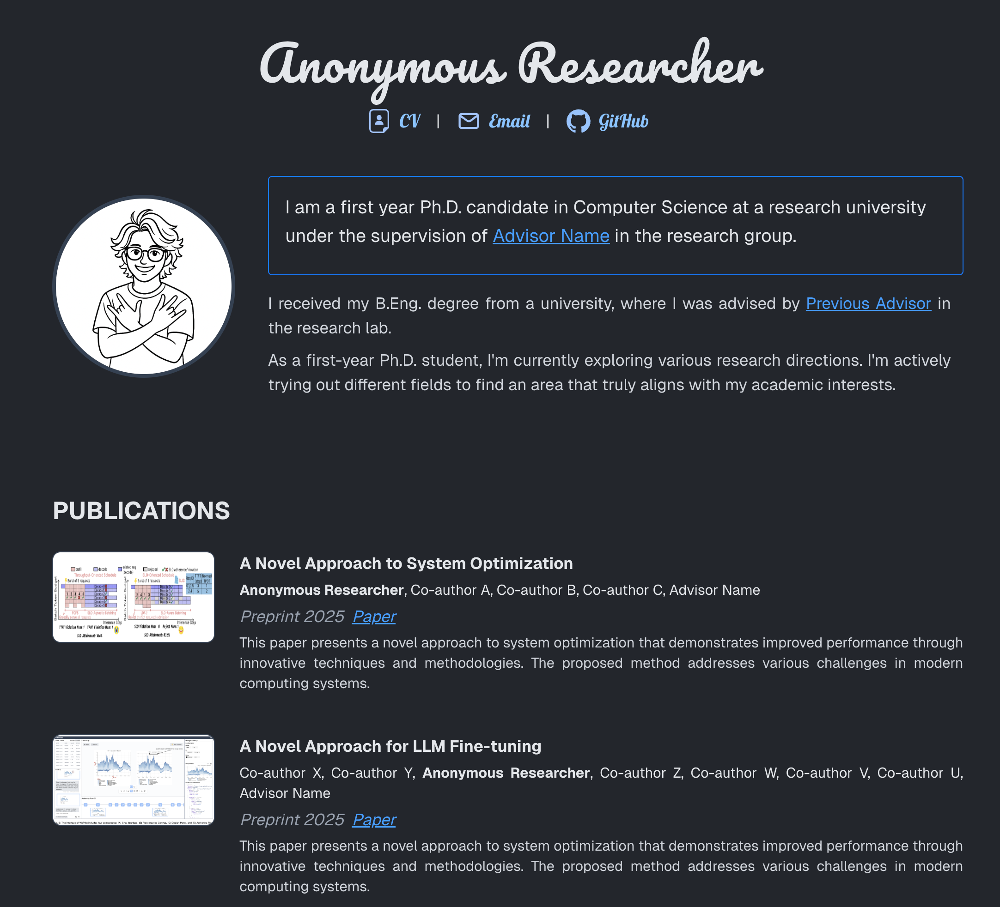

# Personal Academic Website

A clean, modern personal academic website built with Next.js and Tailwind CSS, designed for researchers, Ph.D. students, and academics to showcase their work and publications.



## Features

- **Clean & Elegant Design** 🎹: Beautiful black & white style with minimalist aesthetics
- **Easy Customization** ⚙️: All modifications in one file (`src/data/content.ts`)

## Quick Start

### Prerequisites

- Node.js 18+
- npm, yarn, or pnpm

### Installation

1. **Clone the repository**

   ```bash
   cd personal-website
   ```
2. **Install dependencies**

   ```bash
   npm install
   ```
3. **Start development server**

   ```bash
   npm run dev
   ```
4. **Open your browser**
   Navigate to [http://localhost:3000](http://localhost:3000)

## Deploy to Github Pages

1. **Deploy to GitHub Pages**:

   - Push your code to GitHub
   - Go to your repository Settings → Pages
   - Set source to "Deploy from a branch"
   - Select the `gh-pages` branch
   - Your site will be available at `https://yourusername.github.io` (if repository is named `yourusername.github.io`) or `https://yourusername.github.io/repository-name`

## Customization

Edit `src/data/content.ts` to modify:

- **Personal info**: name, title, email, CV link, GitHub, bio
- **Publications**: Add to `publications` array with title, authors, journal, year, abstract, image, paper link
- **Background**: Update `background` array with education and research info
- **People/Advisors**: Add to `people` object with name and website link
- **Misc**: Update personal interests and quote in `misc` object

Add images to `public/` directory and reference them in `content.ts`.

## License

This project is open source and available under the [MIT License](LICENSE).

**Happy customizing!** 🎉
